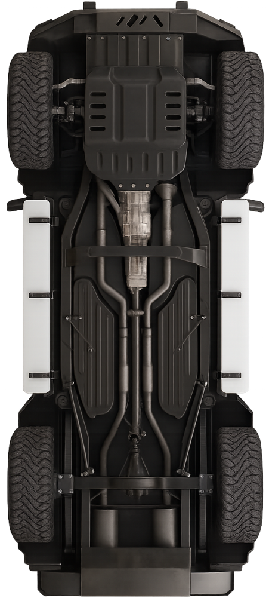

<p align="center">
  
</p>

<h1 align="center">🏎️ LaTTeX — Inspección Vehicular Profesional</h1>

<p align="center">
  <strong>Formularios de inspección multi-punto para talleres automotrices, generados con LaTeX.</strong>
</p>

<p align="center">
  
  
  
  
</p>

<p align="center">
  
</p>

---

## 📋 ¿Qué es LaTTeX?

**LaTTeX** es un sistema de generación de formularios de inspección vehicular multi-punto, diseñado con **LaTeX** para producir documentos PDF de calidad profesional. Ideal para talleres mecánicos, centros de servicio automotriz y distribuidores de llantas.

> *"vergueado no, vergas si"* — Mike, 2026

---

## ✨ Características

| Característica | Descripción |
|---|---|
| 🚗 **Información General** | Modelo, placas, kilometraje, número de serie y razón de ingreso |
| ⚠️ **Luces de Advertencia** | Grid interactivo con 17 indicadores del tablero (motor, aceite, batería, ABS, etc.) |
| ⛽ **Nivel de Gasolina** | Barra visual con 5 niveles: Bajo, 1/4, Medio, 3/4, Lleno |
| 🛢️ **Inspección de Líquidos** | Nivel y color de aceite, anticongelante, dirección hidráulica, líquido de frenos |
| 🔧 **Tarjetas de Neumáticos** | Marca, modelo, medida, PSI (recomendado vs actual), profundidad de huella |
| 🛞 **Frenos y Discos** | Estado de balatas, tambores y discos con indicadores de desgaste |

---

## 🏗️ Estructura del Proyecto

```
lattex/
├── main.tex                    # 📄 Documento principal — estilos, colores, macros y configuración
├── page1.tex                   # 📝 Página 1 — Info general, luces de advertencia, gasolina y líquidos
├── page2.tex                   # 📝 Página 2 — Inspección de neumáticos (layout)
├── tirepage_components.tex     # 🧩 Componentes — TireCard, métricas PSI, barras de frenos
├── KodeMono-VariableFont_wght.ttf  # 🔤 Tipografía Kode Mono (variable)
├── top.png                     # 🖼️ Banner superior del formulario
├── logo.png                    # 🖼️ Logo del taller
├── carro.png                   # 🖼️ Imagen del vehículo
├── Goodyear.png                # 🖼️ Logo de marca de llanta
└── *.png                       # 🖼️ Iconos de advertencia del tablero
```

---

## 🚀 Inicio Rápido

### Requisitos Previos

- **TeX Live** (2023+) o **MiKTeX** con XeLaTeX
- Fuente **Montserrat** instalada en el sistema
- Fuente **Kode Mono** (incluida en el repositorio)

### Compilación

```bash
# Compilar el documento con XeLaTeX
xelatex main.tex
```

> ⚡ **Nota:** Es necesario usar `xelatex` (no `pdflatex`) ya que el proyecto utiliza `fontspec` para manejar las tipografías del sistema.

---

## 🎨 Personalización

### Colores

Los colores principales están definidos en `main.tex` y se pueden ajustar fácilmente:

```latex
\definecolor{warningyellow}{HTML}{FCC01A}  % Amarillo de advertencia
\definecolor{trackgray}{HTML}{E6E6E6}      % Gris de las barras
\definecolor{oiltrack}{HTML}{E6E6E6}       % Gris para la barra de aceite
```

### Datos del Vehículo

Los datos se editan directamente en `page1.tex`:

```latex
% Modelo del vehículo
VOLKSWAGEN TIGUAN 2026

% Placas
JCZ-263-A

% Kilometraje
85,000
```

### Indicadores de Advertencia

Cada luz del tablero se activa o desactiva con `1` o `0`:

```latex
\warniconij{0}{0}{engine.png}{1}    % ✅ Encendida
\warniconij{1}{0}{oil.png}{0}       % ❌ Apagada
```

### Nivel de Gasolina

```latex
\gasolinebar{4}  % 0=BAJO, 1=1/4, 2=MEDIO, 3=3/4, 4=LLENO
```

### Líquidos

```latex
\oillevelbar{2}        % 0=DEBAJO, 1=A NIVEL, 2=ARRIBA
\oilcolorselector{0}   % 0=Limpio, 1=Medio, 2=Quemado
\fluidselectorfour{1}{Anticongelante}  % 0=N/A, 1=Arriba, 2=A Nivel, 3=Debajo
```

---

## 🛞 Componentes UI

### Luces de Advertencia

El formulario incluye **17 iconos** del tablero del vehículo:

| Icono | Indicador | | Icono | Indicador |
|---|---|---|---|---|
| `engine.png` | Motor | | `abs.png` | ABS |
| `oil.png` | Aceite | | `tractionControl.png` | Control de tracción |
| `battery.png` | Batería | | `doors.png` | Puertas |
| `air.png` | Aire | | `immobilizer.png` | Inmovilizador |
| `throttle.png` | Acelerador | | `brake.png` | Frenos |
| `celsius.png` | Temperatura | | `brakePark.png` | Freno de mano |
| `maintenance.png` | Mantenimiento | | `tire.png` | Neumáticos |
| `lighbulb.png` | Luces | | `windshield-washer.png` | Limpiaparabrisas |
| `steering-wheel.png` | Dirección | | | |

### Tarjeta de Neumáticos (TireCard)

Cada neumático se documenta con una tarjeta completa:

```latex
\TireCard{goodyear.png}{WRANGLER ALL TERRAIN ADVENTURE W/KEVLAR 110T}
  {315/35R21}       % Medida
  {210}              % Índice de velocidad
  {210}              % Índice de carga
  {{35}{25}}         % PSI {recomendado}{actual}
  {3 mm}             % Profundidad
  {{BUENA (>9MM)}{8 mm}}   % Balatas {estado}{desgaste}
  {{BUENA (>9MM)}{9 mm}}   % Discos  {estado}{desgaste}
```

---

## 📦 Paquetes LaTeX Utilizados

| Paquete | Uso |
|---|---|
| `geometry` | Configuración de márgenes |
| `graphicx` | Inclusión de imágenes PNG |
| `fontspec` | Fuentes del sistema (Montserrat) y variables (Kode Mono) |
| `tcolorbox` | Cajas de formulario con bordes redondeados |
| `xcolor` | Definición de colores personalizados |
| `tabularx` | Tablas responsivas |
| `tikz` | Gráficos vectoriales (barras, selectores, iconos) |

---

## 🤝 Contribuciones

¡Las contribuciones son bienvenidas! Si tienes ideas para mejorar el formulario:

1. Haz un **fork** del repositorio
2. Crea una rama con tu mejora (`git checkout -b feature/mi-mejora`)
3. Haz commit de tus cambios (`git commit -m 'Agregar mi mejora'`)
4. Haz push a la rama (`git push origin feature/mi-mejora`)
5. Abre un **Pull Request**

---

<p align="center">
  Hecho con ❤️, LaTeX y muchas ganas de que quede <strong>espectacular</strong>
</p>
